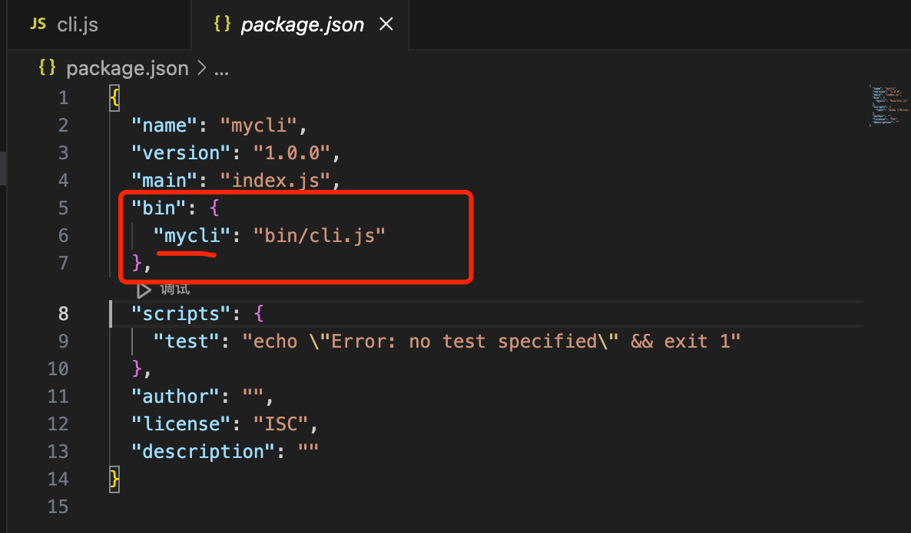
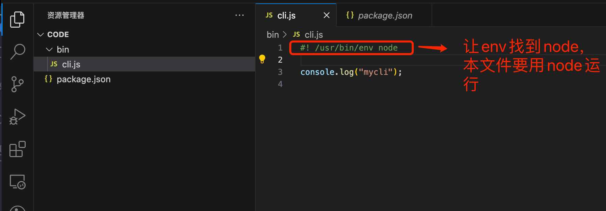
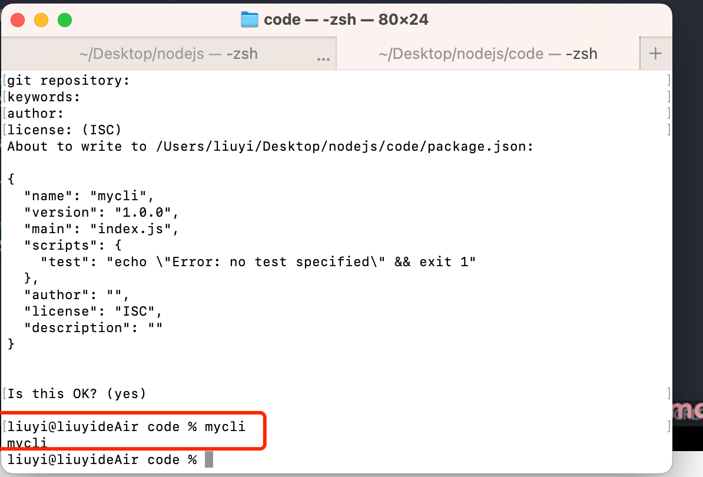
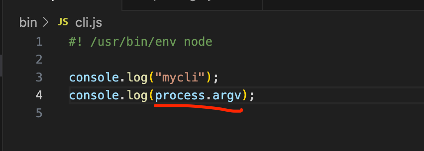
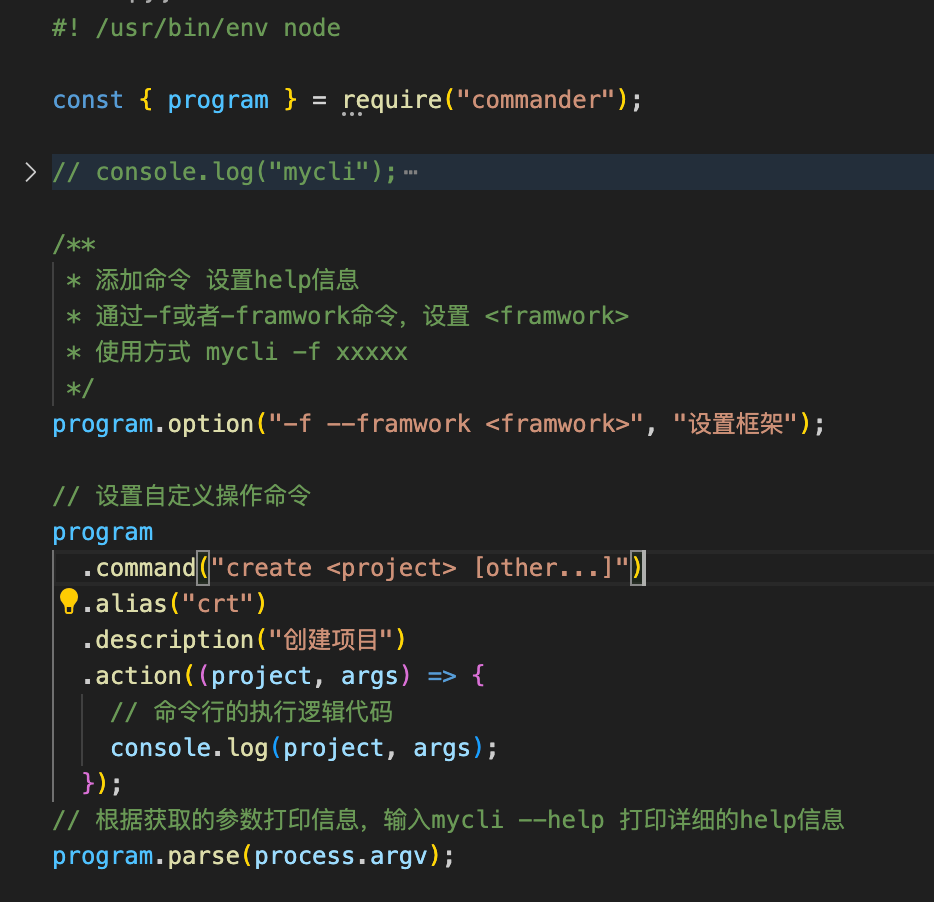

## 1.先创建bin目录和cli.js空文件
## 2.npm init,
  得到 脚手架命令mycli
  

## 3..执行npm link进行挂载


## 4 ，设置bin/cli.js,就可以在全局任何命令行中使用mycli了


## 5.使用process.argv获取mycli后跟着的参数


## 6 使用cammander包处理--help和其他参数选项

### 6.1     npm install cammmander

## 7 使用inquirer包处理命令行问答

```
npm install inquirer
```

``` js
const inquirer = require("inquirer");
inquirer.default
        .prompt([
          {
            type: "input",
            name: "userName",
            message: "请输入你的名字",
          },
          {
            type: "list",
            name: "framwork",
            choices: ["express", "koa"],
            message: "请选择你使用的框架",
          },
        ])
        .then((answer) => {
          //获取问题答案
          console.log(answer);
        })
        .catch((err) => {
          console.log(err);
        });
```
## 8 下载仓库模版代码
```
npm i download-git-repo
```

```js
const download = require("download-git-repo");
download(
            "liudafengshu/Web3-Frontend-Bootcamp", //路径
            "test/tmp", //下载到test/tmp路径
            function (err) {
              //回调函数
              console.log(err ? "Error" : "Success");
            }
          );
```

## 9 下载等待提示交互
```
npm install ora@5 //5以后的版本不支持commonjs
```
```js
const ora  = require("ora");

const spinner = ora('开始下载').start();

setTimeout(() => {
    spinner.succeed("结束下载");
         // spinner.fail("下载失败")
}, 1000);
```
10 命令行渲染工具
 ```
npm install chalk@4 //5开始不支持commandjs规范
```
```js
const chalk = require("chalk")
console.log(chalk.blue('Hello world!'));
```
