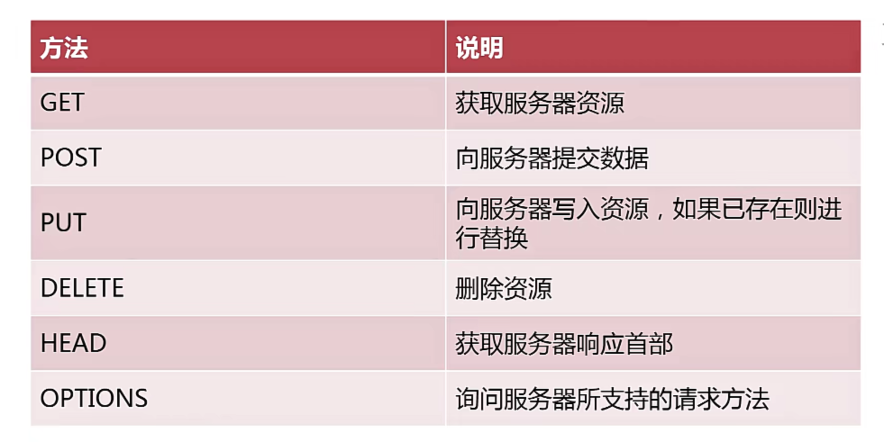
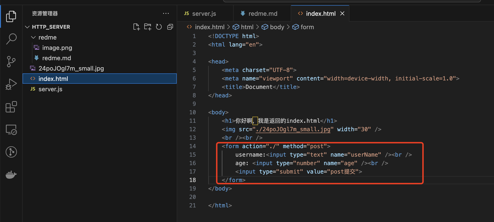
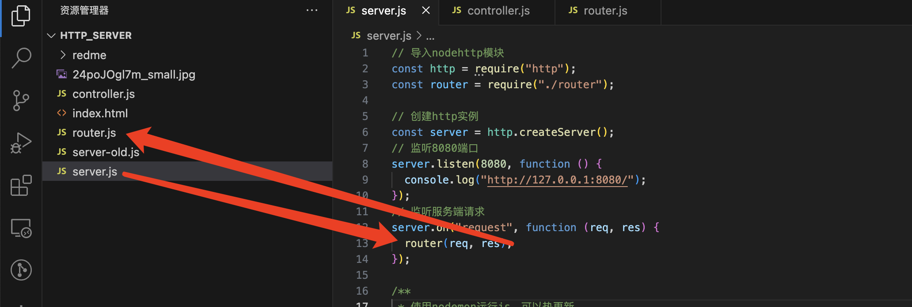
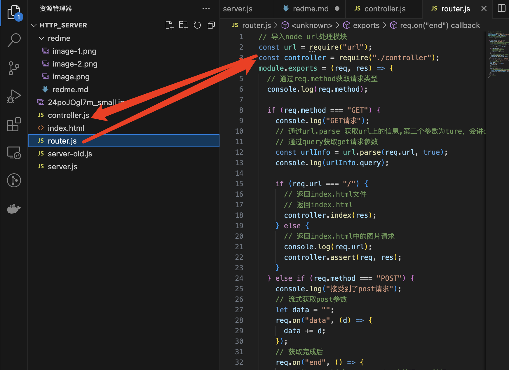
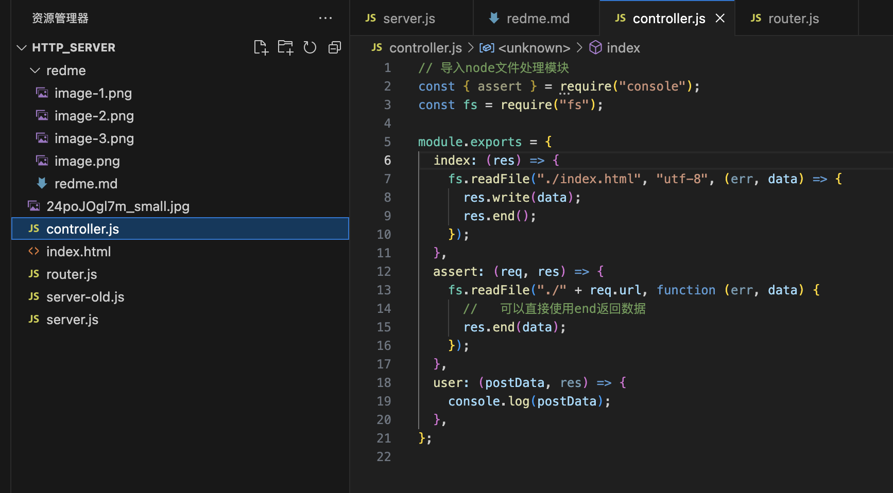

# 原声node创建服务器
## 1使用node创建服务器
```js
// 导入http模块
const http = require("http");
// 创建http实例
const server = http.createServer();
// 监听8080端口
server.listen(8080, function () {
  console.log("http://127.0.0.1:8080/");
});
// 监听服务端请求
server.on("request", function (req, res) {
  console.log("9999");
  // 返回响应
  res.write("88888");
  // 断开连接
  res.end();
});

 ```

 ```shell
# 使用nodemon运行js，可以热更新
npm i nodemon -g
nodemon server.js
 ```

## 2服务器响应数据类型处理
```js
server.on("request", function (req, res) {
  // 返回响应
  //   res.write("88888");

  //   设置响应数据类型为utf-8
  //   res.setHeader("Content-Type", "text/plain;charset=utf-8");
  //   res.write("你好");

  // 设置响应html
  //   res.setHeader("Content-Type", "text/html;charset=utf-8");
  //   res.write("<h1>你好</h1>");

  // 断开连接
  //   res.end();

    // 返回index.html文件
  if (req.url === "/") {
    // 返回index.html
    fs.readFile("./index.html", "utf-8", (err, data) => {
      res.write(data);
      res.end();
    });
  } else {
    // 返回index.html中的图片请求
    console.log(req.url);
    fs.readFile("./" + req.url, function (err, data) {
      //   可以直接使用end返回数据
      res.end(data);
    });
  }
});
```

## 3.http的不同请求方法的处理
常用方法有以下几种

```js

/**
 *  省略其他代码，仅保留获取请求方式和获取请求参数代码
*/ 

// 导入nodehttp模块
const http = require("http");
// 导入node url处理模块
const url = require("url");

// 创建http实例
const server = http.createServer();
// 监听8080端口
server.listen(8080, function () {
  console.log("http://127.0.0.1:8080/");
});
// 监听服务端请求
server.on("request", function (req, res) {
  // 通过req.method获取请求类型
  console.log(req.method);
  if (req.method === "GET") {
    console.log("GET请求");
    // 通过url.parse 获取url上的信息,第二个参数为ture，会讲query格式化为object
    // 通过query获取get请求参数
    const urlInfo = url.parse(req.url, true);
    const query = urlInfo.query;
    console.log(urlInfo.query);

    //然后就可以拿到query执行其他操作了.....
    res.end(query)
  } else if (req.method === "POST") {
    // .....post请求执行其他操作
  } else {
    // .......
  }
});

```

## 4接收并处理POST请求参数
    先创建一个post请求
    
```js

// 监听服务端请求
server.on("request", function (req, res) {
    // 先请求页面
  if (req.method === "GET") {
    const urlInfo = url.parse(req.url, true);
    if (req.url === "/") {
      fs.readFile("./index.html", "utf-8", (err, data) => {
        res.write(data);
        res.end();
      });
    } else {
      console.log(req.url);
      fs.readFile("./" + req.url, function (err, data) {
        res.end(data);
      });
    }
  } else if (req.method === "POST") {
    // 再通过表单请求post
    console.log("接受到了post请求");
    // 流式获取post参数
    let data = "";
    req.on("data", (d) => {
      data += d;
    });
    // 获取完成后
    req.on("end", () => {
      // 引入node核心包querystring来处理data数据
      const postData = require("querystring").parse(data);
      console.log(postData.userName);
      res.end();
    });
  } else {
    // .......
  }
});
```

## 5 服务器代码模块拆分
我们拆分出了server.js,router.js,controller.js





