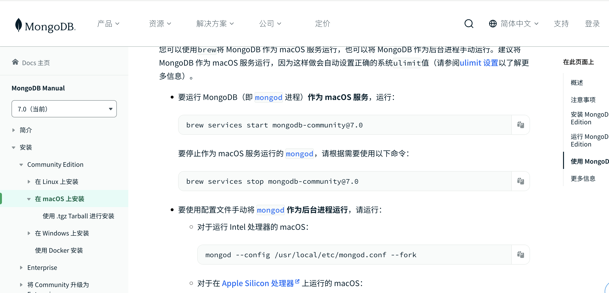
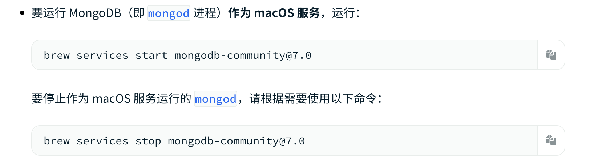
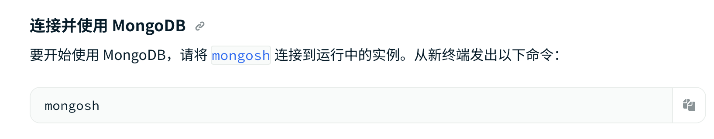
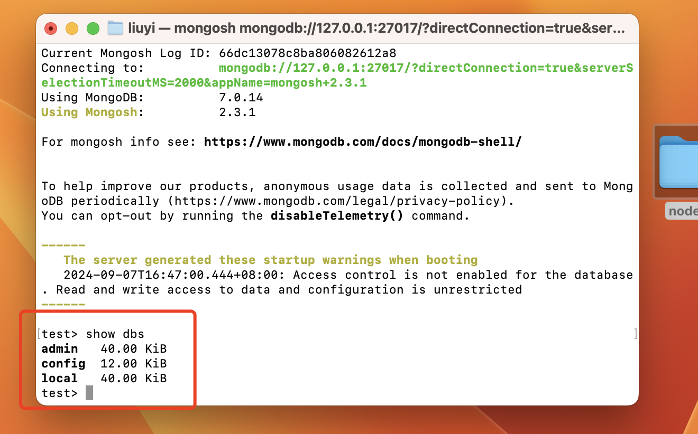
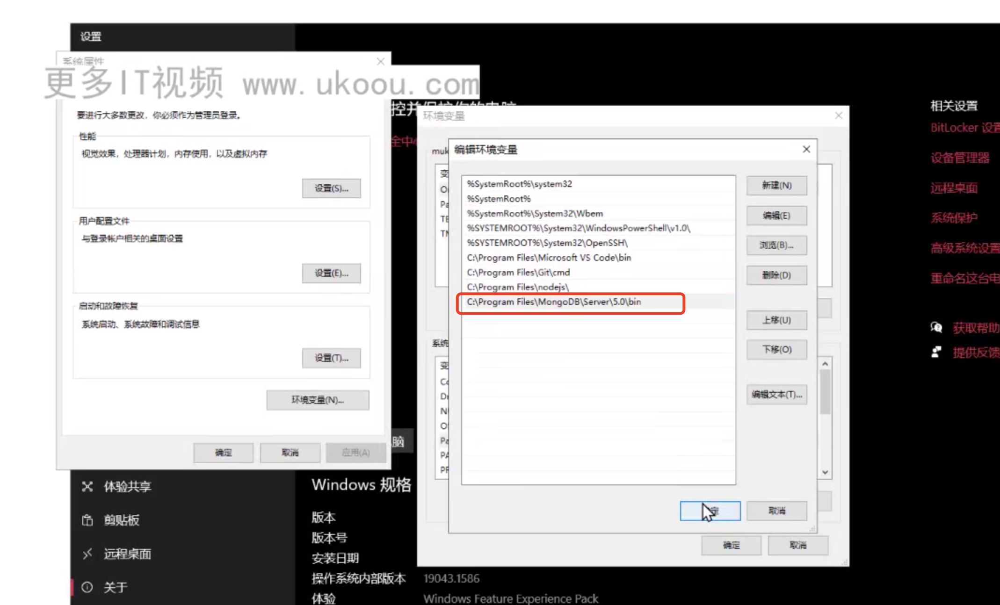
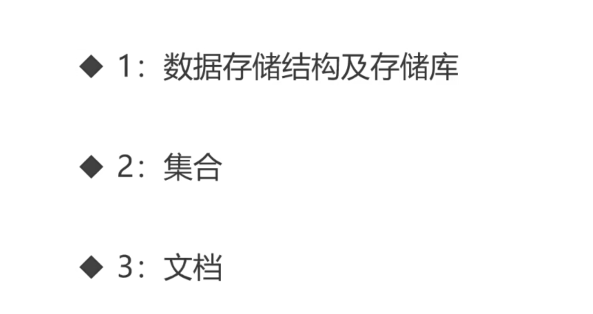

## 1 下载安装Mongo

安装好后，先启动MongoDb

然后链接MongoDb

然后可以通过show dbs 查看数据库已有的表


## 2 mongo shell执行环境 与客户端
 mongo shell windows需要将mongo安装路径添加到环境变量，才能在任意终端使用mongosh命令
 

常用命令
```shell
show dbs #查看所有库
use admin #进入admin库中
db      #查看当前所在的库
exit; # 退出mongoshell 连接，主要要带分号
quit(); # 同上
```

## 3 第三方客户端连接mongo服务器
推荐 navicat

## 4 MongoDb的基础概念


推荐全小写命名，不要特殊符号和空格
```shell
use mytest # 如果mytest库不存在，就会创建mytest库，并切换到mytest

# 需要在库中添加数据才会存在，否则只存在于表中
# 下面在当前mytest 库中创建了名为cc的集合，并写入了{x:1,y:2}
db.cc.insert({x:1,y:2})
# 创建ff集合并插入数据
db.ff.insert({name:"lisa",age:18})

# 查看库中所有集合
show collections

# 删除cc集合
db.cc.drop()

db.dropDatabase()  #删除当前库
```

## 5 MongoDb 基本增删改查

```shell
# 以下在集合cc中操作
# 插入一条数据
db.cc.insertOne({name:"lisa",age:20})
# 插入多条数据额
db.cc.insertMany([
    {name:"张三",age:20},
    {name:"李4",age:30}
])

# 查找所有数据
db.cc.find()
# 查找数据 查找name
db.cc.find({name:"张三"})
# 查找age大于15的
db.cc.find({age:{$gt:15}})
# 查找一条age大于15的
db.cc.fineOne({age:{$gt:15}})

# 更新一条数据  修改张三的age为25，
# 第一个参数为查询条件，第二个参数为修改的数据,需要使用$set
db.cc.updateOne({naem:"张三"}，{$set:{age:25}})
# 更新多条数据  修改张三的age为25
db.cc.updateMany({naem:"张三"}，{$set:{age:25}})

# 删除数据 删除一条age为18的
db.cc.deleteOne({age:18})
# 删除数据 删除所有age为18的
db.cc.deleteMany({age:18}) 

```

## 使用node 链接MongoDb
```shell
npm install mongodb
```
```js
const { MongoClient } = require('mongodb');

// 初始化信息
const url = 'mongodb://localhost:27017';
const client = new MongoClient(url);
// Database Name
const dbName = 'mytest';

async function groutMongodb() {
    // 连接服务
    await client.connect();
    // 连接mytest库
    const db = client.db(dbName);
    // 连接ff集合
    return db.collection('ff');
}

async function main() {
    const collection = await groutMongodb()

    // 插入一条数据
    // const data = await collection.insertOne({ name: "张三", age: "12" })
    // 插入多条数据
    // const data = await collection.insertMany([
    //     { name: "张三", age: 12 },
    //     { name: "张1", age: 18},
    //     { name: "张2", age: 20 },
    // ])

    // 查找一条名为张三的数据
    // const data = await collection.findOne({ name: "张三" })
    // 查找所有名为张三的数据,查找多条数据需要 toArray处理
    // const data = await collection.find({ name: "张三" }).toArray()
    // 查找大于18岁的数据
    // const data = await collection.find({ age: { $gt: 18 } }).toArray()
    // 查找小于18岁的数据
    // const data = await collection.find({ age: { $lt: 18 } }).toArray()

    // 修改一条数据
    // const data = await collection.updateOne({ name: "李4" }, { $set: { age: 999 } })
    // 修改多数据
    // const data = await collection.updateMany({ name: "lisa" }, { $set: { age: 888 } })

    // 删除一条数据 
    // const data = await collection.deleteOne({ name: "张三" })
    // 删除多条数据 
    const data = await collection.deleteMany({ name: "张三" })

    return data
}

main()
    .then(console.log)
    .catch(console.error)
    .finally(() => client.close());
```

