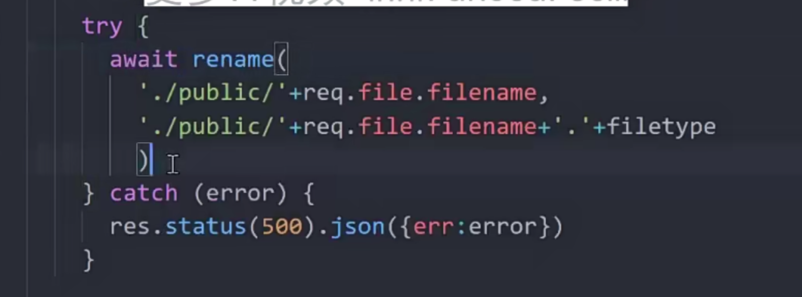

## 1 用户修改

自定义验证

解密token后将token的数据传入req

更新数据库数据

## 2文件上传操作
只处理form-data数据类型请求

以中间键的形式调用，将数据中headimg对应的文件上传到设置的public文件中,会讲上传成功的数据传入req.file，传递给下一个中间键使用

保存的文件，文件名缺少格式
手动处理保存的文件名

允许直接请求public下的静态资源，请求时就不需要public路径了

## 3 阿里云视频点播voD服务
视频不建议自己处理，通过第三方服务例如阿里云voD

四种都要开通

客户端访问服务端拿到上传凭证后，再通过凭证请求阿里云

##### 3.1创建ram用户授权

添加权限vod全部

获得key

##### 3.2获取上传地址和凭证

##### 3.3 express操作

## 4 视频信息入库
视频集合user字段关联用户集合

## 5 视频列表及分页展示
skip(传入跳过的条数)
limit(想要查询的条数)

sort({排序的字段名：1 正序，-1 倒序})

查询关联的user用户数据

查询总的数据条数

## 6 视频详情获取
populate 第二个参数，查询关联用户的数据字段，用空格分开

修改jwt登录验证规则，通过入参判断是否需要登录,默认需要验证登录

 ## 7 频道订阅与取消订阅
 创建集合，两个字段，分别是：用户是谁，被关注的是谁
 
 记录用户的粉丝数量
 

## 8 获取频道信息
 一个用户就是一个频道
## 9 关注列表和粉丝列表
查询关注的用户信息列表，只选择需要的字段后返回，敏感数据不返回

## 10添加视频评论
创建表记录。就行了，谁评论了哪个视频，评论了什么信息，三个字段就够了
增删改查，都是业务逻辑

## 11 喜欢与不喜欢视频
与订阅频道和取消频道相似
like字段记录， 1为喜欢，-1为不喜欢，

## 12

