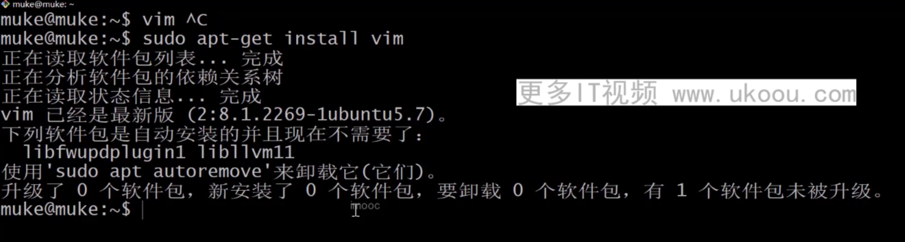
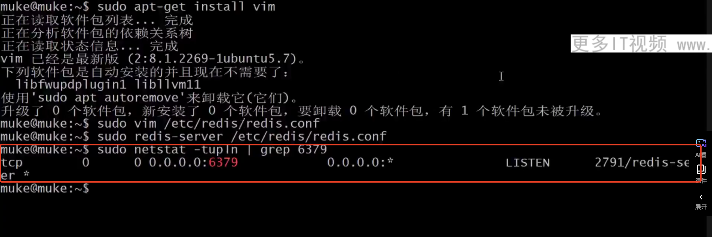
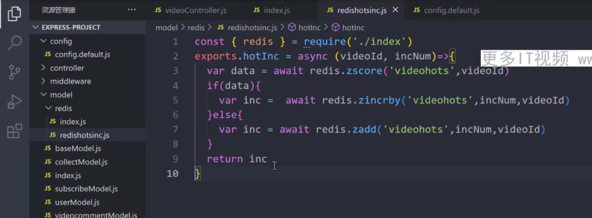

 
 ## 1 什么是redis
 适合大量数据高并发
 应用场景 如：
排行榜 计数器

## 2 安装redis
和mongodb一样，版本号第二位如果是奇数，就是开发版，偶数就是稳定版
官网
https://redis.io/docs/latest/operate/oss_and_stack/install/install-redis/install-redis-on-mac-os/


 ## 3 redis-cli 客户端连接

```shell
# 连接本地默认端口6379 redis-cli
redis-cli
# 连接127.0.0.1上 1234端口的redis
redis-cli -h 127.0.0.1 -p 1234

# 以下均为连接redis-cli后输入
# 查找当前有多少存储的键
key *
# 退出redis-cli
quit
# ping操作
ping
# 查看redis状态
info
# 查看服务器状态
info server

```
## 4 redis数据库
redis 默认有16个数据库，名字为0～15

使用redis-cli操作， 设置一个变量s1为1

这时候key * 就能查到s1了

切换到12号数据库

12号中没有s1了

将当前数据库中的s1移动到12号数据库

获取s2的值

晴空所有数据库中的所有数据

绝大部分情况我们只操作零号数据库就够了

## 5 redis 数据类型及操作命令
常见数据类型


redis可以使用任何二进制数据作为键，意思是任何值都可以作为键，键盘的最大值可以是512m（不重要）

## 6 redis列表操作
创建列表L1，并向L1列表中添加三个元素

获取列表L1从第1个到第三个的数据，列表下标从0开始，1是代表第二个

在88前面插入一个44

获取index为3的值

获取列表长度

获取列表第一个元素并删除它

获取最后一个元素并删除它


集合操作（Set）
添加一个名为s1的集合，创建了三个数据11，22，33

获取集合中所有数据

获取集合中有多少元素

随机从集合中获取一个值

随机从集合中获取多个值

删除集合中的一个成员

随机删除一个成员


有序集合的操作（Zset）
创建Zset z1，添加数据。两个一组，通过第一个字段排序

ZRANGE 集合名 开始位置 结束为止；通过这个规则获取集合中的数据，升序排列

ZREVRANGE 规则同上，不过是降序排列

获取升序排列后，从第index为3开始获取到为99的值

从小到大获取u2的排名，排名从零开始

从大到小获取u4的排名，排名从零开始

获取有序集合的成员数

增加某个数据的值，设置的第一个数据

删除某个值


redis通用操作
```shell
# 查看redis数据库里面有哪些数据
kye *
# 查看某个值的数据类型，例如查看s1的
TYPE s1
# 删除某个数据 例如删除s1
DEL s1
# 将s4重命名为s1
RENAME s4 s1
```

## 7 使用ndoejs操作redis
使用ioredis
new Redis 时不传参数，则默认连接127.0.0.1:6379

redis会默认开始安全模式不允许远程连接
设置一个登录需要的密码 ，例如设置为root

redis-cli 使用密码连接

nodejs中ioredis 使用密码连接redis

还需要在对redis进行一些配置才能连接
先安装vim

使用vim修改redis配置文件，

vim中 输入-h往左移动光标输入，l往右移动光标，g上，k下
esc退出编辑模式
i 输入
添加bind * 允许所有客户端访问

按esc 输入： 代表保存
配置使用密码登录，默认是注释掉的，重启就会失效

之后按下esc键，输入:wp保存并退出
使用新的redis配置文件重新启动redis

验证是否可以请求

成功之后再去nodejs中连接redis，就可以连接成功了


## 8 热度排名案例


## 9 通过redis做视频收藏，并且判断热门推荐
热度逻辑

连接redis

记录热度方法

获取前num个热门视频和对应热度


推荐一个非官方redis学习的中文网站
www.redis.com
