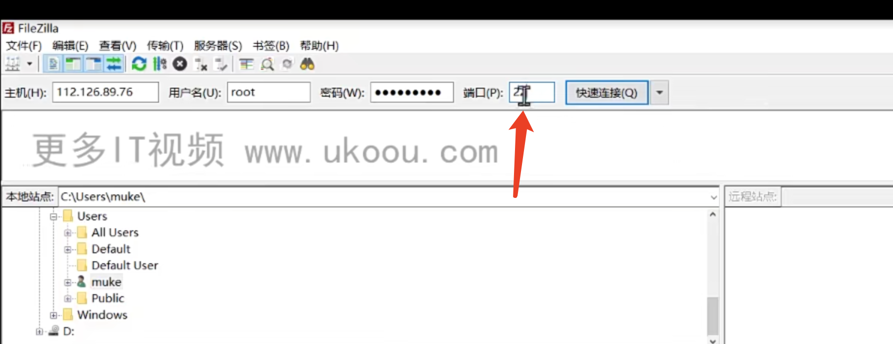

## 1云服务器购买与环境搭建
购买云服务器
安装linux版nodejs
安装linux版mongodb
安装linux版redis

## 2 nginx 介绍与安装


安装


nginx -v 查看版本

文件位置，一般不要修改
/usr/share/nginx/

配置文件位置：
/usr/share/etc/nginx/nginx.conf

日志位置：
/usr/share/etc/nginx/var/log/nginx/
access.log记录每一次请求日志
error.log记录错误日志


所有的http服务器占用的都是80端口
查看80端口的占用情况

ifconfig 查看本机ip地址
阿里云ifconfig查看到的是内网ip，需要公网ip才可以访问


通过公网ip访问


## 3nginx工作模型与常用命令

启动nginx与停止nginx
```shell
# 启动
nginx
# 停止 stop，立即停止，杀死所有子进程
nginx -s stop
# 第二种停止nginx方式，
# quit 优雅停止，子进程工作执行结束后停止，此时不接受新请求
# 对用户更友好，建议使用
nginx -s quit
```


更新nginx的log记录文件，单纯给log文件改名创建log文件，log还会写入以前的文件，因为nginx按照启动时的磁盘位置寻找文件，而不是按照文件名


ll可以查看当前文件夹下的文件详情


检查nginx配置文件是否有错误

重新加载nginx配置文件


## 4 nginx配置项解析


## 5 nginx 反向代理
通过filezilla上传文件到服务器

ssh连接方式使用22端口连接

云服务默认只允许开放80端口，其他端口允许访问需要手动去安全组中添加

将请求反向代理到3000端口

vim展示行号


反向代理


## 6 项目部署与域名解析

## 7 配置https安全协议


签发成功后选择nginx的证书下载，上传到服务器

修改配置

修改default，default 被引入到的nginx.conf


nginx -t 检查配置文件
nginx -s reload 重新加载配置文件
现在就需要通过https请求了


## 发布npm包
设置npm镜像源为官方
本地登录npm

name不能在npm存在
每次更新必须更新版本号

使用命令更新版本号


发布包
