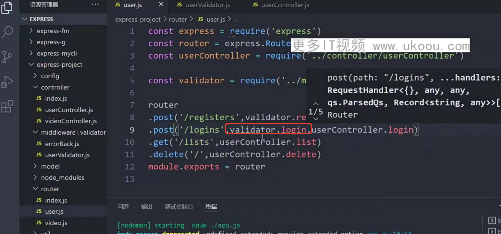
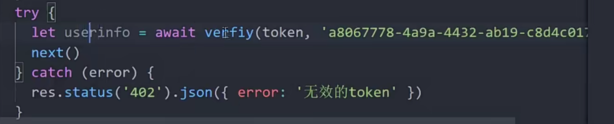

## 1 express 中间键基本概念及应用 
会在路由方法调用之前执行，需要执行next()方法，才会继续调用路由方法

中间键的位置很重要，在对中间键后面的路由规则生效

## 2 express 中间键分类


##### 2.1应用程序级中间键
```js
const express = require("express")
const app = express()
// 应用程序级中间键
app.use((req,res,next)=>{
    //逻辑代码
    next()
})

// 限定请求方法的中间键,针对/index请求的中间键,可
// 以接受多个函数作为参数，通过next(),链式执行
app.use("/index"，(req,res,next)=>{
    //逻辑代码
    next()
},（req,res,next）=>{
    // 路由代码
),(req,res,next)=>{res.send()})

qpp.listen(3000,()=>{
    console.log("http://127.0.0.1:3000")
})
```

##### 2.2路由级中间键
可以拆封多个路由，只需要都在app.js中挂载
```js
// router/index.js  拆分路由

const router = express.Router();
router.get("/",(req,res)=>{

})
router.get("/users",(req,res)=>{

})
module.exports = router
```
```js
// /app.js  挂载路由

const express = require("express")
// app.js中导入router
const router = require("./router/index.js")
const routerVideo = require("./router/video.js")

const app = express()

// 挂载router中间键
// app.use(router)

/**
 * 挂载router中间键,设置匹配规则，
 * 带有/user的请求才会执行当前中间键盘
 */
app.use("/user",router)
app.use("/video",routerVideo)

qpp.listen(3000,()=>{
    console.log("http://127.0.0.1:3000")
})
```
##### 2.3 错误处理中间键
```js
const express = require("express")
const router = require("./router/index.js")
const routerVideo = require("./router/video.js")

const app = express()

app.use("/user",router)
app.use("/video",routerVideo)

// 如果前面的中间键都没有匹配到，就会走这里用来兜底处理未被定义的请求
app.use((req,res)=>{
    res.status(404).send("404 not found")
})
/**
 * 错误处理的中间键
 * 如果有4个参数，express会认为这是一个捕获前面处理请求错误的中间键
 */
app.use((err,req,res,next)=>{
    console.log(err)
    res.status(500).send("service Error")
})


qpp.listen(3000,()=>{
    console.log("http://127.0.0.1:3000")
})
```
## 3 Express 路由
```js
const express = require("express")
const router = require("./router/index.js")
const routerVideo = require("./router/video.js")

const app = express()

// 使用请求
app.get("/users",(req,res)=>{})
app.post("/users",(req,res)=>{})

// all:  get post都匹配  不常用
app.all(("/users"),(req,res)=>{})  

// 支持正则  不常用
app.get("/us?ers",(req,res)=>{})

/**
 * 支持参数，注意，get请求的参数也是这样获取
 * 示例请求localhost://users/3/video/45
 */
app.get(("/users/:id/video/:vid"),(req,res)=>{
    // 获取到id和vid，
    // 注意：get请求的常规参数体也用params获取 
    // 示例：示例请求localhost://users/video?id=3&vid=45,传递了一样了参数
    consoe.log(req.params) 
    res.send()
})  

/**
 * 链式调用
 * 下面代码等价于
 *  app.get("/",(req,res)=>{})
    app.post("/users",(req,res)=>{})
 */
app
.get("/",(req,res)=>{})
.post("/users",(req,res)=>{})

// 返回客户端数据的方法
app.get("/",(req,res)=>{
    // 返回数据
    res.send("hello")
    // 需要客户端下载的资源通过download返回
    res.download()
    // 结束当前请求，可以携带数据
    res.end("hello")
    // 将数据转成json格式返回
    res.json({msg:"hell0",code:200})
    // 重定向
    res.redirect()
    // 渲染模版
    res.render()
    // 设置状态码 404
    res.status(404)
    // 链式调用 如
    res.status(200).json({name:"liu",age:20})
})


// 使用路由
app.use("/user",router)
app.use("/video",routerVideo)

qpp.listen(3000,()=>{
    console.log("http://127.0.0.1:3000")
})
```

## 4 项目基础设计搭建优化
 


## 5 使用数据处理模块mongoose

```shell
npm i mongoose
```

## 6 客户端提交数据校验
通过第三方中间键 express-validator
```shell
npm i express-validator
```
创建并导出 验证错误的回调函数

创建验证规则，将其传入上面的回调中,并导出

在路由中使用


## 7 Resufut API 接口规范设计
https://restfulapi.cn/


这个是比较常用的规范


## 8 用户登录信息对比
验证数据


数据库对密码字段的设置

登录接口


## 9 jwt用户身份认证
介绍 ： https://restfulapi.cn/jwt
官网： https://jwt.io/libraries
使用：https://github.com/auth0/node-jsonwebtoken
```shell
$ npm install jsonwebtoken
```
第一个参数为我们想要携带的数据额
第二个参数为我们设置的私钥，加密解密都需要同样的私钥，
解密后就可以得到加密时携带的数据了


## 10 用户登录认证与接口鉴权
创建token

登录接口返回token


我们用这种方式携带token，放在请求头的Authorization中
注意前面要加Bearer,Bearer和token之间要有空格
Authorization:Bearer token内容


验证token  /util/jwt.js



以中间键的方式使用


