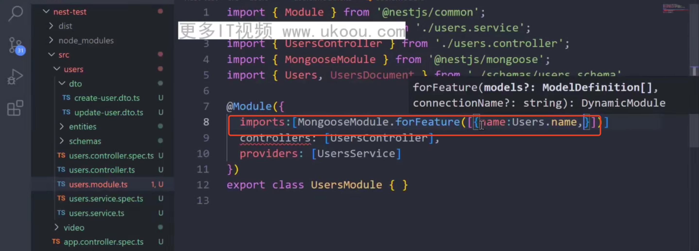

 ## 1 nest框架的介绍与运行
 
 

 

 ## 2 nest 模块概念与应用

 ## 3 nest-cli创建基础代码
命令行创建模块，自动引入

使用命令行创建controller和service

直接生成一个支持增删改查的模块，包含上面创建的全部内容

## 4 nest集成swagger

@body,参数装饰器，将这个post请求中body参数全部给到createuserDto

通过入参类型在ts中提示参数

使用ApiProperty用来在swagger中提示参数的含义

 
 ## 5 nest中的装饰器
  nest中提供的的功能基本都以装饰的形式使用
 充当路由
 

 集成swagger

 接收参数
 
 

## 6 provider 与依赖注入

一个类通过依赖注入另一个类后可以直接使用

## 7 nest 模版代码梳理
main.js

app.module.js

其他

## 8 nest 集成mongooose

导出类型

导出schema

## 9 nest 中的增删改查操作

user.module.ts

user.service.ts

入库

查询所有数据

查询一条数据

修改数据

删除数据

